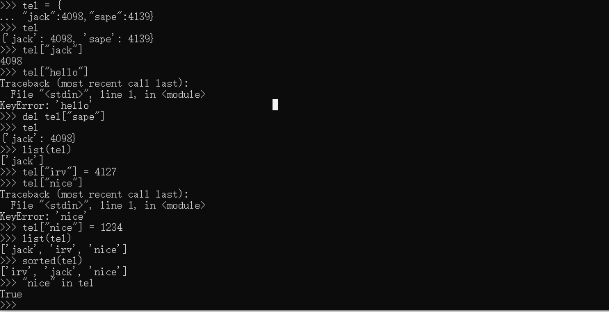

# Python Tutorial

## 1. 解释器

**启动**

Unix: python

Windows: py


**传入参数**

解释器读取命令行参数，**把脚本名与其他参数转化为字符串列表存到sys模块的argv变量中。该列表最少有一个元素，具体情况如下:

~~~python
import sys
if __name__ == "__main__":
    print(sys.argv)
~~~

 在控制台输入:-m (module)命令 test是文件名，后面跟着参数，可以看到打印出了对应的模块路径以及参数信息


除了在控制台使用参数启动模块，还可以使用交互模式，如下:


**解释器的运行环境**

默认情况下，python源码文件的编码是utf-8.如果不适用，应该在第一行用注释写出来,如下：

~~~python
# -*- coding: cp1252 -*-
~~~

上面声明使用windows-1252编码

## 2.Python 速览

**2.1 计算器**

python中加减乘除取余等操作，几乎和c语言一致，但有几点需要注意

+ python 中 / 表示浮点数除法，如果想使用c中的忽略小数的除法，可以使用 //

  

+ python 中一个 * 表示乘法，两个 *表示指数运算

  

+ python **全面支持浮点数** ，混个类型运算的结果会转化为浮点数

+ 在交互模式下，上次的表达式会赋给变量_，具体如下:

  

+ 除了int 和 float ，python还支持其他数字类型，例如Decimal 或 Fraction。**python还内置支持复数**，后缀j表示虚数

**2.2 字符串**

python中字符串可以使用单引号 '...',或者双引号 "...",结果相同，反斜杠 \ 用于转义。


如果不希望前置\ 字符转义，可以在整个字符串前加上r


字符串字面值可以实现跨行连续输入，实现方式是三引号:


**拼接和重复**

使用+ 合并字符串，或者使用* 重复字符串


**支持下标索引和切片**


第一行数字是字符串中索引 0...6 的位置，第二行数字是对应的负数索引位置。***i* 到 *j* 的切片由 *i* 和 *j* 之间所有对应的字符组成**。


索引越界会报错，但是切片可以自动处理越界索引，如下：


**Notes**:python中的字符串是不能修改的，即immutable，因此为字符串某个索引位置赋值会报错。


如果想生成不同的字符串，就应该新建一个字符串:


内置函数len()返回字符串的长度：


**2.3 列表**

列表是一种符合类型，其中的元素用逗号隔开，元素的类型可以不一样


**列表也支持切片和索引,切片操作返回列表的浅拷贝**


**列表支持合并操作**


**与字符串不一样的是，列表是mutable类型**


append是列表的函数，可以在列表尾部添加数据

列表的切片赋值可以改变列表的内容，大小，甚至直接清空列表，例如


**len()也支持列表**


## 3. 控制流

### 3.1 if

if语句可以包含零个或多个elif字句，以及可选的else字句。

~~~python
if x ==0 :
    print("0")
elif x >0:
    print("1")
else:
    print("-1")
~~~

 


### 3.2 for

python中的for语句和c中不一样，python的for不能迭代算数递增数值，而是迭代列表或者字符串等序列，元素的迭代顺序与在序列中出现的顺序一致。例如:

~~~python
words = ["cart", "dog", "windos"]
for w in words:
    print(w,len(w))
~~~


遍历某个几个的同时修改集合的内容，很难获取想要的结果。要在遍历时修改集合的内容，应该遍历该集合的副本或者创建新的集合：

~~~python
# Strategy: Iterate over a copy
for user, status in users.copy().items():
    if status == 'inactive':
        del users[user]
   
# Strategy: Create a new collection
active_users = {}
for user, status in users.items():
    if status == 'active':
        active_users[user] = status
~~~


### 3.3 range()

内置函数range() 常用于遍历数字序列，该函数可以生成算数级数:

~~~python
for i in range(5):
    print(i)
~~~

range(start,end,step)

range() 和 len() 可以一起使用:

~~~python
a = ["mary", "had", "a", "little", "lamb"]
for i in range(len(a)):
    print(i, a[i])
~~~


大多数情况下，enumerate()函数更便捷:

~~~python
for i , elem in enumerate(words):
    print(i, elem)
~~~

Notes: range() 返回对象的操作和列表很想，但其实不是一回事，迭代时，该对象基于所需序列返回连续项，并没有生成真正的列表，从而节省了空间。这种对象称为**可迭代对象iterable**,函数或对象可通过该对象获取连续项，知道所有元素全部迭代完毕。

### 3.4 迭代

**break语句，continue语句，else字句**

break 语句与c语言中类似，但是else在python中是可以作为for循环的字句的，如果for循环完所有的元素，或者while循环条件为假，那么执行else语句，但若是从break语句跳出循环，就不会执行else字句

~~~python
for n in range(2,10):
    for x in range(2,n):
        if n%x ==0:
            print(n, 'equals', x, '*', n // x)
            break
     else:
        print(n, 'is a prime number')
~~~

continue 语句和break语句都和c语言中的一样


### 3.5 pass 语句

pass 语句不执行任何操作，语法上需要一个语句，在程序不执行任何动作时，可以使用该语句

~~~python
while True:
    pass

# 创建一个最小的类
class MyEmptyClass:
    pass

~~~

 ## 4. 函数


定义函数:def function(args):

函数被定义之后，会在函数局部生成符号表，连接局部变量，函数即使没有return返回，其实也是有返回值的None


### 4.1 默认参数

在定义函数的时候，为一些参数赋值一些默认的值:

~~~python
def ask_ok(prompt, retries=4, reminder = "please try again"):
    while True:
        ok = input(prompt)
        if ok in ('y', 'ye', 'yes'):
            return True
        if ok in ('n', 'no', 'nop', 'nope'):
            return False
        retries = retries - 1
        
        if retries < 0:
            raise ValueError('invalid user response')
         print(reminder)
~~~


**重要警告**:**默认值只计算一次**。默认值为列表，字典，或类实例等可变对象时，会产生与规则不同的结果。例如，下面的函数会累积后续调用时传递的参数

~~~python
def f(a, L=[]):  # 默认值不能为可变对象
    L.append(a)
    return L
print(f(1))
print(f(2))
print(f(3))

输出结果为：
[1]
[1, 2]
[1, 2, 3]
~~~

如果不想在后续调用中，共享默认值的，应使用如下方式编写函数:

~~~python
def f(a, L=None):
    if L is None:
        L = []
     L.append(a)
    return L

print(f(1))
print(f(2))
print(f(3))
输出结果为:
    [1]
    [2]
    [3]
~~~

对上面情况的解释：


### 4.2 关键字参数

kwarg = value 形式的关键字参数也可以调用函数:

~~~python
def parrot(voltage, state='a stiff', action = 'voom', type = "Norwegian Blue"):
    print("-- This parrot wouldn't",action, end = ' ')
    print("if you put", voltage, "volts through it.")
 
# 关键字参数
parrot(1000)
parrot(voltage = 1000)
parrot(voltage = 1000, acton = 'VOOOM')
parrot(action= "VOOOOM", voltage = 10000)
parrot(voltage = 5.0, "dead") # error 关键字参必须再位置参数后面
~~~


**最后一个参数为\*\*name形式时，接受一个字典，该字典包含与函数中已定义形参对应之外的所有关键字参数。**\*\*name 形参可以与\*name形参组合使用，（*name必须在\*\*name前面），\*name形参接收一个元组，该元组包含形参列表之外的**位置参数**，例如下面:

~~~python
def cheeseshop(kind, *args, **keywords):
    print("-- Do you have andy",kind, "?")
    print("-- I'm sorry ,we are all out of",kind)
    for arg in args:
        print(arg)
    print("-" * 40)
    for kw in keywords:
        print(kw, ":",keywords[kw])
~~~


### 4.3 任意实参列表

调用函数时，使用任意数量的实参是最少见的选项。这些实参包含在**元组**中。在可变数量的实参之前，可能有若干普通参数:

~~~python
def write_multiple_items(file, separator, *args):
    file.write(separator.join(args))
~~~

`variadic` 实参用于采集传递给函数的所有剩余实参，因此，它们通常在形参列表的末尾。`*args` 形参后的任何形式参数只能是仅限关键字参数，即只能用作关键字参数，不能用作位置参数:

~~~python
def concat(*args, sep = "/"):
    return sep.join(args)
~~~


### 4.4 解包实参列表

函数调用要求独立的位置参数，但实参可能在列表或者元组中，我们需要把实参从元组或列表中取出，然后调用函数，使用*操作可以将参数从列表或元组中解包出来:


同样可以用\*\*操作符传递关键字参数


### 4.5 lambda表达式

lambda关键字用于创建小巧的匿名函数。Lambda函数可用于任何需要**函数对象**的地方。**lambda函数可以引用包含作用域中的变量**.


上例用lambda表达式返回函数，还可以把匿名函数用作传递的实参:

~~~python
pairs = [(1,"one"),(2,"two"),(3,"three"),(4,"four")]
pairs.sort(key = lambda pair:pair[1])
~~~


### 4.6 文档字符串


**函数标注是可选的用户自定义函数类型的元数据完整信息**


## 5. 数据结构

#### 5.1 列表
|函数名称| 原型|用法|
|---|---|---|
|append|append(item) |追加一个元素|
|extend|extend(iterable)|用可迭代对象扩展列表|
|insert|insert(index,item)|在索引index处插入元素|
|remove|remove(item)|删除列表中第一个item,未找到指定元素时，触发**ValueError**异常|
|pop|pop(index)|删除列表中指定位置元素并返回被删除元素，未指定位置则删除最后一个元素|
|clear|clear()|删除所有元素，相当于 del a[:]|
|count|count(x)|返回列表中x出现的次数|
|sort|sort(\*,key = None,reverse = False)|排序|
|reverse|reverse()|反转列表中的元素|
|copy|copy()|返回列表的拷贝|

一些使用的例子如下:


**note:**用列表实现堆栈非常方便，只需要append和pop()就能实现，但是使用列表实现队列效率很低，因为在列表的末尾添加和删除元素非常快，但是在列表开头插入和删除元素非常慢。

**实现队列最好用collections.deque**，可以快速从两端添加或删除元素.


**列表推导式**

格式为: expression + n*(for | if )

常见的用法为，对序列或可迭代对象中的每一个元素应用某种操作，用生成的结果创建新的列表，或用满足特定条件的元素创建子列表。

例如创建平方值的列表 :


**上述循环结束后， 变量x仍然存在，使用下面方法可以无副作用的计算平方列表**

~~~python
squares = [x**2 for x in range(10)]
~~~


另一个例子:

~~~python
[(x, y) for x in [1,2,3] for y in [2,4,5] if x!= y]
~~~

**嵌套的列表推导式**

~~~python
[[row[i] for row in matrix] for i in range(4)]
~~~

上面这个例子等价于

~~~python
transposed = []
for i in range(4):
    transposed.append([row[i] for row in matrix])
~~~


实际的应用中，最好用内置函数来替代复杂的流程语句,此时用zip()函数更好:

~~~python
list(zip(*matrix))
~~~

上面的应用是使用zip 和 * 配合进行解包然后拼接

#### 5.2 del 语句

del 语句按索引而不是值从列表中移除元素。


#### 5.3 元组和序列

元组由多个逗号隔开的值组成:


输出时，元组要用圆括号标注，这样才能正确解释嵌套元组。输入时，括号可有可无。

**元组和列表比较**

+ 元组不可变，是immutable,列表可变，是mutable
+ 元组一般包含异质元素，通过**解包**和索引访问，列表一般为同质元素，可迭代访问。
+ 元组有一种特殊情况，对0个或者1个元组，需要特殊对待|


+ **序列解包**是个重要的知识点

#### 5.4 集合

set() 集合是由**不重复**元素组成的**无序**容器，基本用法包括成员检测，消除重复元素，集合对象还支持交集，合集，差集，对称差分等数学运算。**注意，空集合只能用set()创建，不能使用{}，{}创建的是空字典**。


**集合推导式**

~~~python
a = {x for x in "abcdefdaksk" if x not in "abc"}
~~~


#### 5.5 字典

字典就是 键值对，需要注意的是，字典的键**必须是不可变的类型，哪怕是元组中包含列表这种间接可变也不行，但是元组包含元组是可以作为字典的键的**。

+ del 删除键值对
+ 用已存在的键进行存储数据，原关键字对应的值会被取代，通过不存在的键**提取值**就会报错。
+ list(dist) 返回字典中所有键的列表,sorted(dist)返回排序好的键的列表
+ 检查字典中是否存在某个键，使用关键字in



**创建字典的方法**

1. 使用{}

2. 使用dict

   ~~~python
   dict([("hello",123),("nice",345),("ok",22222)])
   ~~~

3. 字典推导式创建

   ~~~python
   {x:x**2 for x in (1,2,3,4)}
   ~~~

4. 也可以使用关键字参数指定键值创建（太繁琐了）

   ~~~python
   dict(sape = 123, guido = 234, jack = 4098)
   ~~~

#### 5.6 循环技巧

1. 字典循环，使用items()方法可同时取出键值对

   ~~~python 
   for k,v in kngihts.items():
       print(k,v)
   ~~~

2. 在序列循环时，用enumerate()函数可同时取出位置所以和对应的值:

   ~~~python
   for i,v in enumerate(["Hello","tac","toe"]):
       print(i,v)
   ~~~

   

3. 同时循环两个或多个序列时，用**zip()**函数可以将其内的元素一一匹配

   ~~~python
   questions = ["name", "quest", "favorite color"]
   answers = (1,2,3)
   for q,a in zip(questions, answers):
       print("what is your {0}? it is {1}".format(q,a))
   ~~~

4. 逆向循环序列时，先正向定位序列，再调用reversed()函数：

   ~~~python
   for i in reversed(range(1,10,2)):
       print(i)
   ~~~

5. 用sorted()函数，在不改动原序列的基础上，返回一个重新的序列

   ~~~python
   for i in sorted(basket):
       print(i)
   ~~~

6. 使用sorted() 加 set() ，按排序后的顺序，循环遍历序列中唯一的元素

   ~~~python
   for f in sorted(set(basket)):
       print(f)
   ~~~

   

## 6.  模块

### 6.1 基本知识

模块时包含python定义和语句的文件，其文件名是模块加上后缀名.py。再模块内部，通过全局变量**\_\_name\_\_**可以获取模块名（即字符串).

~~~python
# 使用import 导入模块
import test

# 要访问模块中的函数或者变量，直接调用模块名.函数即可
test.__name__  打印test的模块名

# 如果经常使用某个函数，可以把它赋值给局部变量
fibo = test.fibo
~~~


### 6.2 模块详解

+ 模块包含执行语句和函数定义

+ **模块有自己的私有符号表，用作模块中所有函数的全局符号表**

+ 导入的模块名存在当前模块的全局符号表里

+ from import 可以直接把模块里的名称导入到当前模块的符号表。例如:

  ~~~python
  from fibo import fib, fib2
  fib(500) # 直接调用fibo中的函数
  ~~~

  这种方式会导入所有不以下划线(_)开头的名称。大多数情况下，不要用这个功能，这种方式向解释器导入了一批未知名称，可能会覆盖已经定义的名称。

+ 我们可以指定模块导入时的名字使用

  ~~~python
  import fibo as fib
  ~~~

**为了保证运行效率，每次解释器会话只导入一次模块，如果更改了模块内容，必须重启解释器**

### 6.3 以脚本方式执行模块

可以用以下方式运行python模块:

~~~python
python fibo.py <arguments>
~~~

**这项操作会执行模块里面的代码，和导入模块一样，但会\_\_name\_\_赋值为"\_\_main\_\_"**，也就是把下列代码添加到末尾:

~~~python
if __name__ == "__main__":
    import sys
    fib(int(sys.argv[1]))
~~~


### 6.4 模块搜索路径

导入spam模块时，解释器首先查找名为spam的内置模块，如果没找到，解释器再从sys.path变量中的目录列表里面查找spam.py文件。sys.path初始化时包含以下位置:

+ 输入脚本的目录 （未指定文件时的**目录**)
+ PYTHONPATH(目录列表，与shell变量PATH的语法一样)
+ 默认安装目录

初始化后，python程序可以更改sys.path。运行脚本的目录在标准库路径之前，置于搜索路径的开头。即，加载的是该目录里的脚本，而不是标准库的同名模块。


**快速加载**

为了快速加载模块，python把模块的编译版缓存在**\_\_pycache\_\_**

目录中，文件名为 module.python-version.pyc

python在两种情况下不检查缓存:

+ 从命令行直接载入模块，只重新遍历，不存储编译结果
+ 没有源模块，就不会检查缓存，为了支持无源文件发行版本，编译模块必须在源目录下，并且绝不能有源模块


给专业人士的小建议:

+ 在python命令中使用-O 或 -OO开关，可以减小编译模块的大小，-O去除断言语句，-OO去除断言语句和\_\_doc\_\_字符串。优化过的模块带有-opt标签。
+ 从.pyc文件读取的程序不比从.py读取的程序执行快，.pyc只是加载速度更快
+ compileall模块可以为一个目录下的所有模块创建.pyc文件


### 6.5 标准模块

解释器中内置了一些模块，用于访问不属于语言核心的内置操作，其目的主要是为了提高运行效率，或访问系统调用等操作系统原语。这些模块依赖于底层平台的配置选项。

例如，内置的sys模块,sys.ps1 和 sys.ps2定义主次提示的字符串


只有在交互模式下，才定义这两个变量

**变量sys.path 是字符串列表，用于确定解释器的模块搜索路径。**

### 6.6 dir()函数

内置函数 dir() 用于查找模块定义的名称。返回结果是经过排序的字符串列表


没有参数时，dir()返回当前模块内定义的名称

dir()不会列出内置函数和变量的名称，这些内容定义在标准模块builtins里面。

### 6.7 包

包是一种用"点式模块名"构造python模块命名空间的方法

导入包时，python搜索sys.path里的目录，查找包的子目录

python只把含\_\_init\_\_文件的目录当成包，这样可以防止以string等通用名称命名的目录，无意中屏蔽后方模块搜索路径中的有效模块，最简情况下，\_\_init\_\_.py只是一个空文件。

下面是包的一个例子:


从包中导入单个模块:

~~~python
import sound.effects.echo
~~~

这段代码加载子模块 sound.effects.echo,但引用的时候必须使用子模块的全名:

~~~python
sound.effects.echo.echofilter(....)
~~~

另一种导入子模块的方法:

~~~python
from sound.effects import echo
echo.echofilter(...)
~~~

另一种变体

~~~python
from sound.effects.echo import echofilter
echofilter(...)
~~~

**注意：使用from package import item 时，item可以是包的子模块，也可以是包中定义的函数，类，变量等其他名称**

### 6.8 从包中导入*

from sound.effects import * 会将effects下的所有子模块全部导入，可能会产生不必要的副作用。

**唯一的解决方案是提供包的显式索引**

import 语句使用如下惯例：如果包的\_\_init\_\_.py代码定义了列表\_\_all\_\_,运行from package import * 时，它就是用于导入的模块名列表:

~~~python
__all__ =["echo", "surround", "reverse"]
~~~


### 6.9 子包导入

+ 绝对路径导入   from sound.effects import echo
+ 相对路径导入    from ..filters import echo


## 7. 输入输出

### 7.1 字符串输出

+ 格式化字符串字面值，在字符串前面使用f或F,在{}里面填充变量，具体如下

  ~~~python
  year = 2021
  event = "Referendum"
  f'Results of the {year} {event}'
  ~~~

  

+ 字符串的str.format() 方法支持更详细的格式化指令，但需要提供格式化信息

  ~~~python\
  yes_votes = 42_572_654
  no_votes = 43_132_495
  percentage = yes_votes / (yes_votes + no_votes)
  '{:-9} YES votes {:2.2%}'.format(yes_votes, percentage)
  ~~~

+ 按照字符串切片和合并操作完成字符串处理操作

+ 只想快速将变量显示成字符串，可以用repr() 或 str() 函数把值转化成字符串

**str()函数返回供人阅读的值，repr() 则生成适于解释器读取的值。**


### 7.2  f字符串格式化

f字符串的标准格式为:f'....{expresssion:格式说明符}'

~~~python
import math
print(f'The value of pi is approximately {math.pi":.3f}')
~~~


在 ':'后传递整数，为该字段设置最小字符宽度，常用于列对齐:


还有一些修饰符可以在**格式化前转换值，应用!a 使用ascii(),应用!s 使用str(), 应用!r 应用repr()**

 

### 7.3 字符串format()方法

str.format() 方法的基本用法如下所示:

~~~python
print('We are the {} who say "{}!"'.format('knights','Ni'))
~~~

~~~python
print('{0} and {1}'.format('spam', 'eggs'))
print('{1} and {0}'.format('spam','eggs'))
# 使用关键字参数名引用值
print('This {food} is {adjective}'.format(food = "spam", adjective = "absolutely horrible"))
~~~

位置参数和关键字参数可以混用


**\*\***解包字典，具体如下

~~~python
table = {"sjoerd": 4127, "Jack":4098, "Dcab":8638}
print("Jack: {Jack:d}; sjoerd:{Sjoerd:d};Dcab:{Dcab:d}".format(**table))
~~~


### 7.3 读写文件

open() 返回file object ,最常用的参数有两个： open(filename,. mode)

~~~python
f = open("workfile", "w")
~~~

| mode | 功能 |
| ---- | ---- |
| r    | 读 |
|w| 写|
|a|追加|
|r+|读写|


通常，文件以 text mode 打开，即，从文件中读取或写入字符串时，都以指定编码方式进行编码。如未指定编码，默认值与平台相关。在mode中追加'b'，则以binary mode 打开文件，此时数据以字节对象的形式进行读写。**该模式用于所有不包含文本的文件**。

在文本模式下读取文件时，默认把平台特定的行结束符转换为\n.在文本模式下写入数据时，默认把\n转换回平台特定结束符。这种操作方式在后台修改文件数据对文本文件来说没有问题，但会破坏JPEG或exe等二进制文件中的数据。注意，在读写此类文件时，一定要使用二进制模式。

在处理文件对象时，最好使用with关键字，优点是，字句体结束后，文件会正确关闭，即使触发异常也可以。而且，使用with相比等效的try-finally代码简洁的多：

~~~python
with open("workfile") as f:
    read_data = f.read()
~~~

通过with语句，或调用f.close()关闭文件对象后，再次使用该文件对象将会失败。


### 7.4 文件对象方法

f.read(size):可用于读取文件内容，并返回字符串(文本模式),返回字节对象(在二进制模式).size 是可选的参数，**省略size或size为负数时，读取并返回整个文件的内容**。size 为其他值时，读取并返回最多size个字符(文本模式)或size个字节（二进制模式）。如果到达文件末尾，f.read()返回空字符串('').


f.readline() 从文件中读取单行数据，**字符串末尾保留换行符"\n"**,只有在文件不以换行符结尾时，文件的最后一行才会省略换行符，只要readline()返回空字符串，就表示已经到达文件末尾，空行使用'\n'表示，该字符串只包含一个换行符。

如果需要读取多行，可以使用循环遍历整个文件对象，这种操作能**高效利用内存，且代码简单**

~~~python
for line in file:
    print(line, end='')
~~~

如果需要以列表形式读取文件中的所有行，可以用list(f),或者f.readlines()


f.write(string) : 把string的内容写入文件,并**返回写入的字符数量**


**写入其他类型的对象前，要先把它们转化为字符串**（文本模式）或字节对象（二进制模式）：

~~~python
value = ('the answer', 42)
s = str(value)
f.write(s)
~~~


f.tell() 返回整数，给出文件对象在文件中的当前位置，表示为二进制模式下是从文件开始的字节数，以及文本模式下的意义不明的数字。


f.seek(offset, whence) 可以改变文件对象的位置，通过向参考点添加offset计算位置，参考点由whence参数指定。whence值为0时，表示从文件开头计算，1表示使用当前文件位置，2表示使用文件末尾作为参考点，省略whence时，其默认值为0，即使用文件开头作为参考点。


在文本文件中，只允许相对于文件开头搜索。


### 7.5 使用json保存结构化数据

从文件写入或读取字符串很简单，数字则稍显麻烦，**因为read()方法只返回字符串**,这些字符串必须传递给**int()**这样的函数，接受’123’，返回数字值123。保存嵌套列表，字典等复杂数据类型时，手动解析和序列化的操作非常复杂。

python支持JSON这种流行数据交换格式，用户无需没完没了地编写，调试代码，才能把复杂地数据类型保存到文件。json标准模块采用python数据层次结构，并将之转换为字符串表示形式。这个过程称为serializing(序列化).从字符串表示中重建数据称为deserializing(解序列化)。在序列化和解序列化之间，表示对象的字符串可能已经存储在文件或数据中，或通过网络连接发送到远方的机器。

只需一行简单的代码即可查看某个对象的JSON字符串表现形式:

~~~python
import json
x = [1, "simple", "list"]
json.dumps(x)
~~~

dumps()函数还有一个变体，dump，它只将对象序列化为text file，因此，如果f是text file对象，可以这样做:

~~~python
json.dump(x, f)
~~~

要再次解码对象，如果f是已经打开，供读取的text file 对象:

~~~python
x = json.load(f)
~~~

这种简单的序列化技术可以处理列表和字典，但在JSON中序列化任意类的实例，则需要付出额外努力。

  

## 9. 类

### 9.1 python作用域和命名空间

namespace 是一个从名字到对象的映射。当前大部分命名空间都由python字典实现，但一般情况下不会去关注它们（除了要面对性能问题时).命名空间的例子，比如存放内置函数的集合，模块中的全局名称。


属性：任何跟在一个点号之后的名称都称为属性。

属性可以是只读或者是可写的，如果是后者，那么对属性的赋值是可行的。模块属性是可写的，你可以写modname.the_answer = 23.**可写的属性同样可以用del语句删除**，例如del modname.the_answer 将会从名为modname的对象中删除the_answer属性。

命名空间在不同时刻被创建，拥有不同的生存期。**包含内置名称的命名空间是在python解释器启动时创建的，永远不会被删除**，模块的全局命名空间在模块定义被读入时创建，通常，模块命名空间也会持续到解释器退出。被解释器的顶层调用执行的语句（从一个脚本文件读取或交互式地读取）被认为是\_\_main\_\_模块调用的一部分，因此它们拥有自己的全局命名空间。（内置名称实际上也存在于一个模块中，这个模块被称为builtins)

一个函数的本地命名空间在这个函数被调用时创建，并在函数返回或抛出一个不在函数内部处理的错误时被删除。当然，每次递归调用都会有它自己的本地命名空间。

一个作用域时在一个命名空间可直接访问的python程序的文本区域，这里“可直接访问”以为着对名称的非限定引用会尝试在命名空间中查找名称。

虽然作用域是静态地确定地，但它们会被动态地使用。在执行期间地任何时刻，会有3或4个命名空间可被直接访问地嵌套作用域:

+ 最先搜索地最内部作用域包含局部名称
+ 从最近地封闭作用域开始搜索地任何封闭函数的作用域包含非局部名称，也包括非全局名称
+ 倒数第二个作用域包含当前模块的全局名称
+ 最外面的作用域（最后搜索）是包含内置名称的命名空间

下面这个例子演示了如何引用不同作用域和名称空间，以及global和nonlocal会如何影响变量绑定:

~~~python
def scope_test():
    def do_local():
        spam = "local spam"
    def do_nonlocal():
        nonlocal spam
        spam = "nonlocal spam"
    def do_global():
        global spam
        spam = "global spam"
        
    spam = "test spam"
    do_local()
    print("After local assignment:", spam)
    
    do_nonlocal()
    print("After nonlocal assignment:", spam)
    
    do_global()
    print("After global assignment:", spam)
scope_test()
print("In global scope:", scope)
~~~


请注意，**局部**(默认状态)赋值不会改变scope_test对spam的绑定，nonlocal赋值会改变scope_test对spam的绑定，而global赋值会改变模块层级的绑定。

### 9.2 初探类

类引入了一些新语法，三种新对象和一些新语义

#### 9.2.1 类定义语法

最简单的类定义看起来像这样:

~~~python
class ClassName:
    <statement-1>
    ...
    <statement-n>
~~~

**类定义与函数定义一样(def语句)，必须被执行才会起作用。**当进入类定义时，会创建一个新的命名空间，并将其用作局部作用域--因此，所有对局部变量的赋值，都是在这个新命名空间之内。特别的，函数定义会绑定到这里的新函数名称。

当（从结尾处）正常离开类定义时，将创建一个**类对象**。这基本上时一个包围在类定义所创建命名空间内容周围的包装器。原始的（在进入类定义之前起作用的）局部作用域将重新生效，类对象将在这里被绑定到类定义头所给出的类名称。


#### 9.2.2 类对象

类对象支持两种操作：属性引用和实例化

**属性引用**使用python中素有属性引用所使用的标准语法:obj.name.有效的属性名称是类对象被创建时存在于类命名空间中的所有名称。因此，如果类定义是这样的：

~~~python
class MyClass:
    """A simple example class"""
    i = 12345
    def f(self):
        return "Hello, world"
~~~

那么MyClass.i 和MyClass.f 就是有效的属性引用，将分别返回一个整数和一个**函数对象**。类属性也可以被赋值，因此通过赋值来更改MyClass.i的值。\_\_doc\_\_也是一个有效的属性，将返回所属类的文档字符串:"A simple example class".


**类的实例化**

类的**实例化**使用函数表示法。

~~~python
x = MyClass()
~~~

创建类的**新实例**并将此对象分配给局部变量x。**可以把类对象视为是返回该类的一个新实例的不带参数的函数。**


实例化操作会创建一个空对象。许多类喜欢创建带有特定初始状态的自定义实例。为此类定义可能包含一个名为\_\_init\_\_()的特殊方法，就像这样:

~~~python
def __init__(self):
    self.data = []
~~~

当一个类定义了\_\_init\_\_()方法时，类的实例化操作会自动为新创建的类实例发起调用\_\_init\_\_()。因此在这个示例中，可以通过以下语句获得一个经初始化的新实例:

~~~python
x = MyClass()
~~~

当然，\_\_init\_\_()方法还可以有额外参数以实现更高灵活性。在这种情况下，提供给类实例化运算符的参数将被传递给\_\_init\_\_().例如：

~~~python
class Complex:
    def __init__(self, realpart, imagepart):
        self.r = realpart
        self.i = imagepart
 
x = Complex(3.0, -4.5)
x.r, x.i
(3.0, -4.5)
~~~


#### 9.2.3 实例对象

实例对象所能理解的唯一操作是**属性引用**。有两种有效的属性名称：数据属性和方法

根据定义，**一个类中所有是函数对象的属性，都是定义了其实例的相应方法。**

**注意区分实例方法和类的函数对象**。

~~~python
x = MyClass()
~~~

x.f 和MyClass.f 不是一回事，x.f是一个方法对象，而MyClass.f是一个函数对象。


#### 9.2.4 方法对象

通常，方法在绑定后立即调用:

~~~python
x.f()
~~~


在MyClass 示例中，这将返回字符串“Hello,World"。但是，立即调用一个方法不是必须的:x.f 是一个方法对象，它可以被保存起来以后再调用。例如：

~~~python
xf = x.f
while True:
    print(xf())

# 上面的代码将持续打印Hello,World
~~~

方法的特殊之处就在于：**实例对象**会作为函数的第一个参数被传入

~~~ python
class MyClass:
    def f(self):  # 函数对象
        return "Hello,world"
    
x = MyClass
x.f()  # 方法对象
~~~


### 9.3 类和实例变量

一般来说，实例变量是用于每个实例的唯一数据，而类变量用于类的所有实例共享的属性和方法

~~~python
class Dog:
    kind = "canine"  # 所有实例共享的类变量
    
    def __init__(self, name):
        self.name = name  # 每个实例独有的实例变量
~~~


**共享数据可能在涉及mutable对象例如列表和字典的时候导致令人惊讶的结果。**

~~~python
class Dog:
    tricks = []  # mistaken use of a class variable
    
    def __init__(self, name):
        self.name = name
    
    def add_trick(self, trick):
        self.tricks.append(trick)
~~~


正确的类设计应该使用实例变量

~~~python
class Dog:
    def __inti__(self, name):
        self.name = name
        self.tricks = []  # 每条狗创建一个新的空列表
    def  add_trick(self, trick):
        self.tricks.append(trick)
~~~


### 9.4 继承

如果不支持结成，语言特性就不值得称为”类“。派生类定义的语法如下所示：

~~~python
class DerivedClassName(BaseClassName):
    <statement-1>
    ...
    <statement-2>
~~~

名称为BaseClassName必须定义于包含派生类的作用域中。如果基类定义在另一个模块中的时候:

~~~python
class DerivedClassName(modname.BaseClassName)
~~~

派生类定义的执行过程与基类相同，当构造派生类对象时，基类会被记住，此信息将被用来解析属性引用：如果请求的属性在类中找不到，搜索将转往基类中进行查找，如果基类本身也派生自其他类，则递归进行查找。

**python中所有的方法实际上都是virtual方法，也就是说派生类只要实现同样的函数，就会覆盖掉基类函数**。

python中有两个内置函数可被用于继承机制：

+ 使用isinstance() 来检查一个实例的类型：isinstance(obj, int) 仅会在obj.\_\_class\_\_为int或某个派生自int的类时为True
+ 使用issubclass() 来检查类的继承关系：issubclass(bool, int) 为True，因为bool是int的子类。但是，issubclass(float,int)为False,因为float不是int的子类。

#### 9.4.1 多继承

~~~python
class DerivedClassName(Base1, Base2, Base3):
    <statement-1>
    ...
    <statement-2>
~~~

### 9.5 私有变量

那种仅限从一个对象内部访问的”私有“实例变量在python中**并不存在**。但是，大多数python代码都遵循这样一个约定：带有一个下划线的名称(例如_spam)应该被当作是API的非共有部分。

但存在对于类私有成员的有效使用场景，因此存在对此种机制的有限支持，称为**名称改写**，任何形式为\_\_spam的标识符（至少带有两个前缀下划线，至多一个后缀下划线）的文法被替换为_classname__spam,其中classname为去除了前缀下划线的当前类的名称。

~~~python
class Mapping:
    def __init__(self, iterable):
        self.items_list =[]
        self.__update(iterable)
    def update(self, iterable):
        for item in iterable:
            self.items_list.append(item)
            
    __update = update  # 原来update()方法的私有拷贝
    
class MappingSubclass(Mapping):
    def update(self,keys, values):
        # 为update提供了新的签名，但是不会break __init__()函数
        for item in zip(keys, values):
            self.items_list.append(item)
~~~

上面的示例即使在MappingSubclass中引入__update标识符也不会出错，因为它会在Mapping类中被替换为\_Mapping\_\_update 而在MappingSubclass类中被替换为\_MappingSubclass\_\_update。

### 9.6 杂项说明

有时会需要使用类似Pascal 的“record"或c的”struct“这样的数据类型，将一些命名数据像捆绑在一起。这种情况适合定义一个空类

~~~python
class Employee:
    pass

john = Employee() # 创建一个空的额employee记录

# Fill the fields of the record
john.name = "John Doe"
john.dept = "computer lab"
john.salary = 1000
~~~

**实例方法对象也具有属性:m.\_\_self\_\_就是带有m()方法的实例对象，而m.\_\_func\_\_则是该方法对应的函数对象**

### 9.7 迭代器

到目前为止，您可能已经注意到大多数容器对象都可以使用for语句:

~~~python
for element in [1,2,3]:
    print(element)

for element in (1,2,3):
    print(element)
    
for element in {"one":1,"two":2}:
    print(element)
    
for element in open("myFile.txt"):
    print(element)
~~~


for语句会在容器对象上调用iter().该函数返回一个定义了\_\_next\_\_()放法的迭代器对象，此方法将逐一访问容器中的元素。当元素用尽时，\_\_next\_\_（）将引发StopIteration异常来通知终止for循环。你可以使用next()内置函数来调用\_\_next\_\_()方法：


看多迭代器协议的幕后机制，给你的类添加迭代器行为就很容易了，定义一个\_\_iter\_\_()方法来返回一个带有\_\_next\_\_()方法的对象。如果类已经定义了\_\_next\_\_()，则\_\_iter\_\_()可以简单地返回self:

~~~python
class Reverse:
    """Iterator for looping over a sequence backwards"""
    def __init__(self, data):
        self.data = data
        self.index = len(data)
    
    def __iter__(self):
        return self
    
    def __next__(self):
        if self.index ==0:
            raise StopIteration
        self.index = self.index -1
        return self.data[self.index]
   
rev = Reverse("spam")
for item in rev:
    print(rev)
~~~

### 9.8 生成器

生成器是一个用于创建迭代器地简单而强大地工具。它们地写法类似于标准地函数，但当它们要返回数据时会使用yield语句。每次在生成器上调用next()时，它会从上次离开地位置回复执行（它会记住上次执行语句时地所有数据值).

~~~python
def reverse(data):
    for index in range(len(data)-1, -1, -1):
        yield data[index]
   
for char in reverse("golf"):
    print(char)
~~~

可以用生成器来完成地操作同样可以用前一节地基于类地迭代器来完成。但生成器地写法更为紧凑，因为它会自动创建\_\_iter\_\_() 和\_\_next\_\_()方法。当生成器终结时，它们还会自动引发StopIteration。这些特性结合在一起，使得创建迭代器能与编写常规函数一样容易。


### 9.9 生成器表达式

某些简单地生成器可以写成简洁地表达式代码，所用语法与列表推导式类似，但外层为圆括号而非方括号。这种表达式被设计用于生成器将立即被外层函数所使用地情况。生成器表达式相比完整地生成器更紧凑但较不灵活，相比等效地列表推导式更为节省内存。

例如:


## 10.装饰器

装饰器:借用闭包的原理，不需要改动源代码和调用方式，就可以直接添加功能


## 11. 常用模块

### 11.1 os 模块

| 函数名   | 功能         |
| -------- | ------------ |
| os.getcwd() | 获取当前路径 |
|os.listdir()|将当前目录下的文件和目录列出来(列表的形式)|
| os.path.isfile()|判断是否为文件|
| os.path.isdir()| 判断是否为目录|
| os.path.isabs()| 判断是否是绝对路径|
|os.path.abspath()|给定相对路径，返回绝对路径|
|os.remove()| 删除文件|
|os.path.exists()| 检验给处的路径是否存在|
|os.path.split()|返回路径的最后一级和之前的分开(以元组形式返回)|
|os.path.splitext()| 分离拓展名(以元组方式返回) |
|os.paht.dirname()| 获取路径名（以字符串形式返回) |
|os.path.basename()| 获取文件名(带拓展）|
|os.system("command") | 运行shell命令|
|os.chmod(file) | 修改文件的权限|
|os.path.join(dir,filename) | 将目录和文件名拼接起来|

### 11.2 sys模块

+ sys.argv  命令行参数，第一个参数是python脚本路径
+ sys.version   获取python解释器的版本信息
+ sys.platform 返回操作系统平台名称
+ sys.getrecursionlimit()  获取最大递归层数
+ sys.setrecursionlimit(1000)  设置最大递归数
+ sys.getdefaultencoding()   获取解释器默认编码
+ sys.getfilesystemencoding() 获取文件系统的默认编码 

### 11.3 pickle 模块 & json模块

存取复杂的对象到硬盘上

序列化

~~~python
import pickle
pickle.dumps(obj)
~~~


反序列化

~~~python
import pickle
pickle.loads(dmp)
~~~

写入文件

~~~python
import pickle

# 第一种方式，先序列化，然后使用文件二进制写入
data = {....}
dmps = pickle.dumps(data)
f = open("game.pkl","wb")
f.write(dmps)

# 第二种方法，将序列化和文件写入何为一体
f = open("game.pkl", "wb")
pickle.dump(data, f)  # f必须是一个已经打开的文件
~~~


Notes:如果要将pkl中的数据取出来，那么dump几次，就要load几次，load获得的数据顺序是从前往后的。

+ dump 写入文件
+ dumps 生成序列化的字符串
+ load 从文件加载
+ loads 反向序列化


**json模块**

用法和pickle模块一模一样

pickle ： python 专用

json ：所有语言都可以用

json 将对象转换成字符串

**json只能dump一次，不然load的时候会失败**

**pickle vs json**

+ pickle 
  + 只支持python
  + 支持python里面的所有数据类型
  + class -> object, function, datetime 都可以支持
+ json
  + 所有语言都支持
  + 只支持常规数据类型  str,int, dict,set,list,tuple

### 11.4  random模块
```
random.randint(10,100) 返回10-100的随机数,包括100
random.randrange(10,100,step =2) 返回10-100,不包括100,步长为2
random.random()  返回一个随机浮点数
random.choice(’...')  返回随机字符串中的一个
ramdom.sample('...', count)  返回随机字符串中的count个
random.shuffle(list)   将lst(列表)里面的内容打乱,返回NOne

```

**random.sample()**
```python
import string
random.sample(string.digits + string.ascii_lowercase, 5)
```


### 11.5 正则模块 re 的匹配语法:
+ re.match Match a regular expression pattern to the `beginning` of a string
+ re.search	 全局匹配，返回第一个 
+ re.findall 把所有匹配的字符放到列表中，并返回
+ re.split 以` 匹配到的字符当作列表分隔符`,并以列表返回
+ re.sub  匹配字符并替换  signature: sub(pattern, repl, string, count=0, flags=0)
+ re.fullmatch  Match of a regular expression pattern to `all` of a string
 
```
'.' : 匹配任意 **字符**
'^' : 指定字符串开头
'$' : 指定字符串结尾
'*' : 匹配*前一个字符0次或多次
'+' : 匹配+前一次或多次
'?' : 匹配?前一个字符0次或多次
'{m}': 匹配前一个字符m次
'{n,m}' : 匹配前一个字符n到m次
'|' : 或的关系
'(...)' : 分组匹配 ，re.search("(abc){2}a(123)","abcabca34123),能够匹配abcabca123 '\A'  : 从头开始匹配，相当于re.match()  re.search("\Aabc","abcdd") 可以匹配
'\Z'  : 匹配字符结尾 ，同$
'\d'  : 数字 匹配 0-9 
'\D'  : 匹配数字
[...] : []中出现的任何一个，都可以匹配例如:[a-zA-Z]
'\w'  : 匹配 [a-zA-Z0-9]
'\W'  : 非[A-Za-z0-9]
's'   : 匹配空白字符  \t, \n, \r

()分组匹配的方式可以通过groups()获得,得到分组的元组。
'(?P<name>...)' 分组匹配，可以通过groupdict()得到字典,这个很重要
```
**可以在python里面直接 :help re 获得规则帮助**

我们可以将正则模块编译成一个对象，像下面这样:
```python
import re
prog = re.compile(pattern)
result = prog.search(string)
```

**Flags**
+ re.I : 忽略大小写
+ re.M : 多行模式，改变 ‘^' 和 '$'的行为
+ re.S : 改变'.' 的行为，make the '.' special character match any character at all,including the newline.
+ re.X : 允许对表达式写注释,如下:
```
a = re.compile(r"""\d +# the integral part
				\. # the decimal point
				\d * # some fractional digits""",re.X)
```
