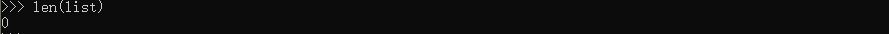

# Python Tutorial

## 1. 解释器

**启动**

Unix: python

Windows: py

**传入参数**

解释器读取命令行参数，**把脚本名与其他参数转化为字符串列表存到sys模块的argv变量中。该列表最少有一个元素，具体情况如下:

~~~python
import sys
if __name__ == "__main__":
    print(sys.argv)
~~~

 在控制台输入:-m (module)命令 test是文件名，后面跟着参数，可以看到打印出了对应的模块路径以及参数信息

除了在控制台使用参数启动模块，还可以使用交互模式，如下:

**解释器的运行环境**

默认情况下，python源码文件的编码是utf-8.如果不适用，应该在第一行用注释写出来,如下：

~~~python
# -*- coding: cp1252 -*-
~~~

上面声明使用windows-1252编码

## 2.Python 速览

**2.1 计算器**

python中加减乘除取余等操作，几乎和c语言一致，但有几点需要注意

+ python 中 / 表示浮点数除法，如果想使用c中的忽略小数的除法，可以使用 //

  

+ python 中一个 * 表示乘法，两个 *表示指数运算

  

+ python **全面支持浮点数** ，混个类型运算的结果会转化为浮点数

+ 在交互模式下，上次的表达式会赋给变量_，具体如下:

  

+ 除了int 和 float ，python还支持其他数字类型，例如Decimal 或 Fraction。**python还内置支持复数**，后缀j表示虚数

**2.2 字符串**

python中字符串可以使用单引号 '...',或者双引号 "...",结果相同，反斜杠 \ 用于转义。

如果不希望前置\ 字符转义，可以在整个字符串前加上r

字符串字面值可以实现跨行连续输入，实现方式是三引号:

**拼接和重复**

使用+ 合并字符串，或者使用* 重复字符串

**支持下标索引和切片**

第一行数字是字符串中索引 0...6 的位置，第二行数字是对应的负数索引位置。***i* 到 *j* 的切片由 *i* 和 *j* 之间所有对应的字符组成**。

索引越界会报错，但是切片可以自动处理越界索引，如下：

**Notes**:python中的字符串是不能修改的，即immutable，因此为字符串某个索引位置赋值会报错。

如果想生成不同的字符串，就应该新建一个字符串:

内置函数len()返回字符串的长度：

**2.3 列表**

列表是一种符合类型，其中的元素用逗号隔开，元素的类型可以不一样

**列表也支持切片和索引,切片操作返回列表的浅拷贝**

**列表支持合并操作**

**与字符串不一样的是，列表是mutable类型**

append是列表的函数，可以在列表尾部添加数据

列表的切片赋值可以改变列表的内容，大小，甚至直接清空列表，例如

**len()也支持列表**

## 3. 控制流

### 3.1 if

if语句可以包含零个或多个elif字句，以及可选的else字句。

~~~python
if x ==0 :
    print("0")
elif x >0:
    print("1")
else:
    print("-1")
~~~

 

### 3.2 for

python中的for语句和c中不一样，python的for不能迭代算数递增数值，而是迭代列表或者字符串等序列，元素的迭代顺序与在序列中出现的顺序一致。例如:

~~~python
words = ["cart", "dog", "windos"]
for w in words:
    print(w,len(w))
~~~

遍历某个几个的同时修改集合的内容，很难获取想要的结果。要在遍历时修改集合的内容，应该遍历该集合的副本或者创建新的集合：

~~~python
# Strategy: Iterate over a copy
for user, status in users.copy().items():
    if status == 'inactive':
        del users[user]
   
# Strategy: Create a new collection
active_users = {}
for user, status in users.items():
    if status == 'active':
        active_users[user] = status
~~~

### 3.3 range()

内置函数range() 常用于遍历数字序列，该函数可以生成算数级数:

~~~python
for i in range(5):
    print(i)
~~~

range(start,end,step)

range() 和 len() 可以一起使用:

~~~python
a = ["mary", "had", "a", "little", "lamb"]
for i in range(len(a)):
    print(i, a[i])
~~~

大多数情况下，enumerate()函数更便捷:

~~~python
for i , elem in enumerate(words):
    print(i, elem)
~~~

Notes: range() 返回对象的操作和列表很想，但其实不是一回事，迭代时，该对象基于所需序列返回连续项，并没有生成真正的列表，从而节省了空间。这种对象称为**可迭代对象iterable**,函数或对象可通过该对象获取连续项，知道所有元素全部迭代完毕。

### 3.4 迭代

**break语句，continue语句，else字句**

break 语句与c语言中类似，但是else在python中是可以作为for循环的字句的，如果for循环完所有的元素，或者while循环条件为假，那么执行else语句，但若是从break语句跳出循环，就不会执行else字句

~~~python
for n in range(2,10):
    for x in range(2,n):
        if n%x ==0:
            print(n, 'equals', x, '*', n // x)
            break
     else:
        print(n, 'is a prime number')
~~~

continue 语句和break语句都和c语言中的一样

### 3.5 pass 语句

pass 语句不执行任何操作，语法上需要一个语句，在程序不执行任何动作时，可以使用该语句

~~~python
while True:
    pass

# 创建一个最小的类
class MyEmptyClass:
    pass

~~~

 ## 4. 函数

定义函数:def function(args):

函数被定义之后，会在函数局部生成符号表，连接局部变量，函数即使没有return返回，其实也是有返回值的None

### 4.1 默认参数

在定义函数的时候，为一些参数赋值一些默认的值:

~~~python
def ask_ok(prompt, retries=4, reminder = "please try again"):
    while True:
        ok = input(prompt)
        if ok in ('y', 'ye', 'yes'):
            return True
        if ok in ('n', 'no', 'nop', 'nope'):
            return False
        retries = retries - 1
        
        if retries < 0:
            raise ValueError('invalid user response')
         print(reminder)
~~~

**重要警告**:**默认值只计算一次**。默认值为列表，字典，或类实例等可变对象时，会产生与规则不同的结果。例如，下面的函数会累积后续调用时传递的参数

~~~python
def f(a, L=[]):  # 默认值不能为可变对象
    L.append(a)
    return L
print(f(1))
print(f(2))
print(f(3))

输出结果为：
[1]
[1, 2]
[1, 2, 3]
~~~

如果不想在后续调用中，共享默认值的，应使用如下方式编写函数:

~~~python
def f(a, L=None):
    if L is None:
        L = []
     L.append(a)
    return L

print(f(1))
print(f(2))
print(f(3))
输出结果为:
    [1]
    [2]
    [3]
~~~

对上面情况的解释：

### 4.2 关键字参数

kwarg = value 形式的关键字参数也可以调用函数:

~~~python
def parrot(voltage, state='a stiff', action = 'voom', type = "Norwegian Blue"):
    print("-- This parrot wouldn't",action, end = ' ')
    print("if you put", voltage, "volts through it.")
 
# 关键字参数
parrot(1000)
parrot(voltage = 1000)
parrot(voltage = 1000, acton = 'VOOOM')
parrot(action= "VOOOOM", voltage = 10000)
parrot(voltage = 5.0, "dead") # error 关键字参必须再位置参数后面
~~~

**最后一个参数为\*\*name形式时，接受一个字典，该字典包含与函数中已定义形参对应之外的所有关键字参数。**\*\*name 形参可以与\*name形参组合使用，（*name必须在\*\*name前面），\*name形参接收一个元组，该元组包含形参列表之外的**位置参数**，例如下面:

~~~python
def cheeseshop(kind, *args, **keywords):
    print("-- Do you have andy",kind, "?")
    print("-- I'm sorry ,we are all out of",kind)
    for arg in args:
        print(arg)
    print("-" * 40)
    for kw in keywords:
        print(kw, ":",keywords[kw])
~~~

### 4.3 任意实参列表

调用函数时，使用任意数量的实参是最少见的选项。这些实参包含在**元组**中。在可变数量的实参之前，可能有若干普通参数:

~~~python
def write_multiple_items(file, separator, *args):
    file.write(separator.join(args))
~~~

`variadic` 实参用于采集传递给函数的所有剩余实参，因此，它们通常在形参列表的末尾。`*args` 形参后的任何形式参数只能是仅限关键字参数，即只能用作关键字参数，不能用作位置参数:

~~~python
def concat(*args, sep = "/"):
    return sep.join(args)
~~~

### 4.4 解包实参列表

函数调用要求独立的位置参数，但实参可能在列表或者元组中，我们需要把实参从元组或列表中取出，然后调用函数，使用*操作可以将参数从列表或元组中解包出来:

同样可以用\*\*操作符传递关键字参数

### 4.5 lambda表达式

lambda关键字用于创建小巧的匿名函数。Lambda函数可用于任何需要**函数对象**的地方。**lambda函数可以引用包含作用域中的变量**.

上例用lambda表达式返回函数，还可以把匿名函数用作传递的实参:

~~~python
pairs = [(1,"one"),(2,"two"),(3,"three"),(4,"four")]
pairs.sort(key = lambda pair:pair[1])
~~~

### 4.6 文档字符串

**函数标注是可选的用户自定义函数类型的元数据完整信息**

## 5. 数据结构

#### 5.1 列表
|函数名称| 原型|用法|
|---|---|---|
|append|append(item) |追加一个元素|
|extend|extend(iterable)|用可迭代对象扩展列表|
|insert|insert(index,item)|在索引index处插入元素|
|remove|remove(item)|删除列表中第一个item,未找到指定元素时，触发**ValueError**异常|
|pop|pop(index)|删除列表中指定位置元素并返回被删除元素，未指定位置则删除最后一个元素|
|clear|clear()|删除所有元素，相当于 del a[:]|
|count|count(x)|返回列表中x出现的次数|
|sort|sort(\*,key = None,reverse = False)|排序|
|reverse|reverse()|反转列表中的元素|
|copy|copy()|返回列表的拷贝|

一些使用的例子如下:

**note:**用列表实现堆栈非常方便，只需要append和pop()就能实现，但是使用列表实现队列效率很低，因为在列表的末尾添加和删除元素非常快，但是在列表开头插入和删除元素非常慢。

**实现队列最好用collections.deque**，可以快速从两端添加或删除元素.

**列表推导式**

格式为: expression + n*(for | if )

常见的用法为，对序列或可迭代对象中的每一个元素应用某种操作，用生成的结果创建新的列表，或用满足特定条件的元素创建子列表。

例如创建平方值的列表 :

**上述循环结束后， 变量x仍然存在，使用下面方法可以无副作用的计算平方列表**

~~~python
squares = [x**2 for x in range(10)]
~~~

另一个例子:

~~~python
[(x, y) for x in [1,2,3] for y in [2,4,5] if x!= y]
~~~

**嵌套的列表推导式**

~~~python
[[row[i] for row in matrix] for i in range(4)]
~~~

上面这个例子等价于

~~~python
transposed = []
for i in range(4):
    transposed.append([row[i] for row in matrix])
~~~

实际的应用中，最好用内置函数来替代复杂的流程语句,此时用zip()函数更好:

~~~python
list(zip(*matrix))
~~~

上面的应用是使用zip 和 * 配合进行解包然后拼接

#### 5.2 del 语句

del 语句按索引而不是值从列表中移除元素。

