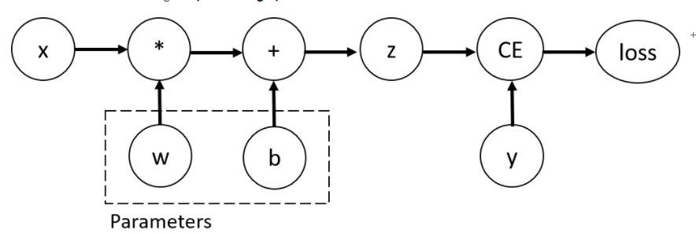

# Pytorch

## 1. Tensors

在pytorch中我们使用tensor 来编码模型的参数，输入和输出。

**1.1  基本知识** 

**与numpy ndarray的区别**

+ tensor 可以放在GPU或者其他的加速器上

+ tensor可以自动求导

+ tensor 和 numpy ndarray 也会共享内存，这样就不必拷贝数据了

  

**1.2 tensor的初始化**

	1. 直接从数据初始化 torch.tensor(data)
	2. 从numpy 转换   torch.from_numpy(n_array)
	3. 从另一个tensor转换  torch.ones_like(x_data) # retains the properties of x_data
		example2:
			x_rand = torch.rand_like(x_data, dtype = torch.float) #这里dtype必须加上，因为x_rand是long类型，我们使用random是float类型，XXX_like()函数会保存原数据的各种属性
	4. 使用随机值或者常量值 
		例子 : shape = (2, 3, ) # shape 是表示形状的元组
			rand_tensor = torch.rand(shape)

**1.3 tensor的属性**

   	1. shape
   	2. datatype
   	3. device

~~~python
print(f"shape of tensor:{tensor.shape}")

print(f"datatype of tensor: {tensor.dtype}")

print(f"device of tensor :{tensor.device}")

~~~

**1.4 operation of tensor**

tensor 的操作总共有一百多种，包括数值计算，线性代数，矩阵操作，采样等,

我们的tensor默认在cpu上，如果我们想把数据放在GPU上，就必须显式地使用.to()函数，当然需要先检查是否可以使用GPU，如下:

~~~python
# move tensor to gpu if avaliable
if torch.cuda.is_available():
    tensor = tensor.to("cuda")
~~~

**1）. 标准的类numpy 的索引和切片**

~~~python
tensor = torch.ones(4,4)
print('First row:', tensor[0])
print('Second column:', tensor[:,1])
print('Last column:',tensor[:,-1])
tensor[:,1] = 0
print(tensor)
~~~

**2）.  拼接tensor**

~~~python
t1 = torch.cat([tensor, tensor, tensor],dim = 1) # 按照维度1拼接tensor
~~~

**3） . 数值操作**

~~~python
y1 = tensor @ tensor.T   # 矩阵乘法
y2 = tensor.matmul(tensor.T)

y3 = torch.rand_like(y2)
torch.matmul(tensor, tensor.T, out=y3)

# y1, y2, y3 结果一样

# element-wise product 
z1 = tensor * tensor
z2 = tensor.mul(tensor)
z3 = torch.rand_like(z2)
torch.mul(tensor,tensor,out = z3)
~~~

**4）. 单元素 tensor**

~~~python
agg = tensor.sum()
agg_item = agg.item()
print(agg_item, type(agg_item))
~~~

**5）. 置位 操作**

将运算结果存储在操作数中的操作，叫做置位(in-place)操作.它们都被表示为_,例如

~~~python
print(tensor,"\n")
tensor.add_(5)
print(tensor)
~~~

Notes:In-place operations save some memory, but can be problematic when computing derivatives because of an immediate loss of history. Hence, their use is discouraged.

**1.5 tensor 和 numpy 之间的转化**

tensor to numpyarray

~~~python
t = torch.ones(size)
print(f"t:{t}")

n = t.numpy()
print(f"n:{n}")
~~~

tensor的改变也会反映在numpy arrays上面

~~~python
t.add_(1)
print(f"t: {t}")
print(f"n: {n}")
~~~

numpy arrays to tensor

~~~python
n = np.ones(5)
t = torch.from_numpy(n)
~~~

numpy 的改变也会反映在tensor上面

~~~python
np.add(n, 1, out = n)
print(f"t: {t}")
print(f"n: {n}")
~~~

## 2. DataSets & DataLoader

解释:

Code for processing data samples can get messy and hard to maintain; we ideally want our dataset code to be decoupled from our model training code for better readability and modularity. PyTorch provides two data primitives: `torch.utils.data.DataLoader` and `torch.utils.data.Dataset` that allow you to use pre-loaded datasets as well as your own data. `Dataset` stores the samples and their corresponding labels, and `DataLoader` wraps an iterable around the `Dataset` to enable easy access to the samples.

PyTorch domain libraries provide a number of pre-loaded datasets (such as FashionMNIST) that subclass `torch.utils.data.Dataset` and implement functions specific to the particular data. 

**Loading a Dataset**

load the FashionMNIST Dataset with following parameters:

+ **root** 是训练和测试数据存储的路径
+ **train** 指定是训练集还是测试集
+ **download = True** 如果在根目录找不到数据，就从网络上下载
+ **transform** and **target_transform** 指定特征和标签的转换

**下载**

~~~python
import torch
from torch.utils.data import Dataset
from torchvision import datasets
from torchvision.transforms import ToTensor
import matplotlib.pyplot as plt

train_data = datasets.FashionMNIST(root = "data", train=True, download= True, transform = ToTensor())

test_data = datasets.FashionMNIST(root = "data", train = False, download =True, transform = ToTensor())
~~~

**遍历和可视化**

像列表一样遍历Datasets ，使用matplotlib进行可视化

~~~python
labels_map = {  # 标签的映射
    0: "T-Shirt",
    1: "Trouser",
    2: "Pullover",
    3: "Dress",
    4: "Coat",
    5: "Sandal",
    6: "Shirt",
    7: "Sneaker",
    8: "Bag",
    9: "Ankle Boot",
}
figure = plt.figure(figsize=(8, 8))
cols, rows = 3, 3
for i in range(1, cols * rows + 1):
    sample_idx = torch.randint(len(training_data), size=(1,)).item()
    img, label = training_data[sample_idx]  # 像list一样访问数据集
    figure.add_subplot(rows, cols, i)
    plt.title(labels_map[label])
    plt.axis("off")
    plt.imshow(img.squeeze(), cmap="gray")  # 需要把tensor转换成可输出的信息
plt.show()
~~~

**创建自己的数据集**

要创建自己的数据集，就必须继承Dataset ,并且实现

~~~python
__init__ , __len__ , __getitem__
~~~

三个函数

具体的实现如下:

~~~python
import os
import pandas as pd
from torchvision.io import read_image

class CustomImgaeDataset(Dataset):
    def __init__(self,annotation_file, img_dir, transform =None, target_transform =None):
        self.img_labels = pd.read_csv(annotation_file)
        self.img_dir = img_dir
        self.transform = transform
        self.target_transform = target_transform

    def __len__(self):
        return len(self.img_labels)

    def __getitem__(self,idx):
        img_path = os.path.join(self.img_dir, self.img_labels.iloc[idx, 0])
        image = read_image(img_path)
        label = self.img_labels.iloc[idx,1]
        if self.transform:
            image = self.transform(image)
        if self.target_transform:
            label = self.tartget_transform(label)
        return image,label
~~~

**用DataLoader为模型训练准备数据**

The Dataset 一次取出一对 的特征和标签。当训练一个模型时，<1>我们以minibatch的形式传递samples，<2> 每一轮次都随机打乱数据，来减少过拟合, <3> 使用python的multiprocessing 来加速数据取出过程

DataLoader (迭代器)

~~~python
from torch.utils.data import DataLoader
train_loader = DataLoader(train_data, batch_size = 64, shuffle = True)
test_loader = DataLoader(test_data, batch_size = 64, shuffle = True)

~~~

**迭代整个DataLoader**

~~~python
train_features , train_labels = next(iter(train_loader))
print(f"Feature batch shape: {train_features.size()}")
print(f"Labels batch shape: {train_labels.size()}")

img = train_features[0].squeeze();
label = train_labels[0]
plt.imshow(img, cmap="gray")
plt.show()
print(f"Label:{label}")
~~~

## 3. Transforms

~~~python
import torch
from torchvision import datasets
from torchvision.transforms import ToTensor Lambda

ds = datasets.FashionMNIST(root = "data",train = True, download =True , transform =ToTensor(),
                          tartget_transform = Lambda(lambda y :torch.zeros(10,dtype = torch.float).scatter_(0,torh.tensor(y),value = 1)))
~~~

这个小技巧非常好:

~~~python
lambda y: torch.zeros(10,dtype=torch.float).scatter_(0,torch.tensor(y),value = 1)

# 创建1-k 的虚拟向量
~~~

## 4. Build Neural Network

torch.nn 命名空间中，提供了创建神经网络的所有基本模块。每一个module都继承于nn.Module。一个神经网络就是一个包含其他modules(layers)的module。

**Get Device for Training**

~~~python
device = "cuda" if torch.cuda.is_available else "cpu"
~~~

这是一个小技巧

**定义神经网络**

通过继承nn.Module 定义我们的神经网络，通过init初始化，每个继承nn.Module 的子类都要实现forward函数

~~~python
class NeuralNetwork(nn.Module):
    def __init__(self):
        super(NeuralNetwork,self).__init__()
        self.flatten = nn.Flatten()
        self.linear_relu_stack = nn.Sequential(
            nn.Linear(input_size, 512),
            nn.ReLU(),
            nn.Linear(512, 512),
            nn.ReLU(),
            nn.Linear(512,10),
            nn.ReLU()
        )
    def forward(self,x):
        x = self.flatten(x)
        logits = self.linear_relu_stack(x)
        return logits
~~~

**使用model**

使用model并不需要显式的调用forward函数

~~~python
logits = model(X)
~~~

x.size() = [3,28,28]

+ flatten = nn.Flatten()  将二维变成一维的连续数组 ,flatten(x) 的size为[3,784]
+ linear = nn.Linear(in_features = 784, out_features = 20)  linear(x)  的size 为[3,20]
+ nn.ReLU() 非线性激活
+ nn.Sequential 是Module的顺序容器，数据按照module定义的顺序传递
+ nn.Softmax(dim =1)  softmax函数，没什么好说的

**获取模型参数**

nn.Module 会自动记录下模型的参数,可以使用parameters() 或者named_parameters() 方法获得

~~~python
for name, param in model.named_parameters():
    print(f"Layer: {name} | Size: {param.size()} | Values : {param[:2]}")
~~~

## 5. 使用torch.autograd 自动求导

当训练神经网络时，最经常使用的算法是反向传播算法。在算法中，参数根据算是函数的梯度调整。

为了计算哪些梯度，pytorch有一个内置的求导引擎叫做`torch.autograd`,它支持任意的计算图的自动求导。

考虑最简单的一层神经网络:

~~~python
import torch
x = torch.ones(5)
y = torch.zeros(3)
w = torch.randn(5,3,requires_grad =True)
b = torch.randn(3,requires_grad = True)
z = torch.matmul(x, w) + b
loss = torch.nn.functional.binary_cross_entropy_with_logits(z,y)
~~~

上述代码对应的计算图如下所示：

在这个网络中，`w` 和`b`都是参数，我们需要优化它们，为了求导优化，我们需要设置`requires_grad`为True。

> 你可以在创建向量时设置`requires_grad=True`,或者之后再使用`x.requires_grad_(True)`。

我们用来构造tensor的计算图的函数，其实是类Function的对象。这个对象知道在前向方向怎么计算函数，在后向传播怎么计算导数。向量中的`grad_fn`属性指向后向传播函数。

~~~python
print("Gradient function for z=",z.grad_fn)
print("Gradient function for loss=",loss.grad_fn)
~~~

### 5.1 计算梯度

为了优化圣经网络中参数的权值，我们需要计算损失函数关于参数的导数，也就是，我们需要计算$\frac{\partial{loss}}{\partial{w}}$和$\frac{\partial{loss}}{\partial{b}}$(在给定`x`和`y`的值的情况下)。为了计算哪些导数，我们调用loss.backward(),然后从`w.grad` 和`b.grad`中得到梯度值

~~~python
loss.backward()
print(w.grad)
print(b.grad)
~~~

> + 我们只可以获取计算图中叶子节点的导数，并且叶子节点的`requires_grad`属性要设置为`True`。所有在图中的节点，它们的导数都不能获得。
> + 在一个给定的计算图上，为了性能的考虑，我们只执行一次导数计算，如果我们需要在同一个计算图上多次`backward`，我们需要传递`retain_graph=True`给`backward`调用。

### 5.2 禁止梯度追踪

默认的，所有的`requires_grad=True`的向量都会追踪它们的计算历史并且支持梯度计算。但是有一些情况下我们不需要这样做，比如，当我们已经训练完了模型，然后想将模型运用在一些输入数据上时，我们只希望执行`forward`操作。我们可以通过把我们的代码包含在`torch.no_grad()`里面来停止追踪计算。

~~~python
z = torch.matmul(x,w) + b
print(z.requires_grad)

with torch.no_grad():
    z = torch.matmul(x,w) + b
	print(z.requires_grad)
~~~

另一种停止追踪计算过程的方法是使用detach()

~~~python
z = torch.matmul(x, w) + b
z_det = z.detach()
print(z_det.requires_grad)
~~~

### 5.3 计算图的更多知识

## 6. 优化模型参数

 完整的步骤：

1. 加载数据集
2. 生成迭代器dataloader
3. 定义模型
4. 定义超参数
5. 定义损失函数和优化器
6. 编写训练循环和测试循环
7. 运行！

## 7. 保存和加载模型

这章节我们将学习怎么保存模型的状态

~~~python
import torch
import torch.onnx as onnx
import torchvision.models as models
~~~

### 7.1 保存和加载模型权值

PyToch模型将学习的参数存储在内部的状态字典中，叫做`state_dict`.我们可以通过torch.save 方法来保存它们。

~~~python
model = models.vgg16(pretrained =True)
torch.save(model.state_dict(), 'model_weights.pth')
~~~

为了加载模型的权重，你需要创建相同的模型的实例，然后使用load_state_dict()方法加载参数

~~~python
model = models.vgg16
model.load_state_dict(torch.load('model_weights.pth'))
model.eval()
~~~

